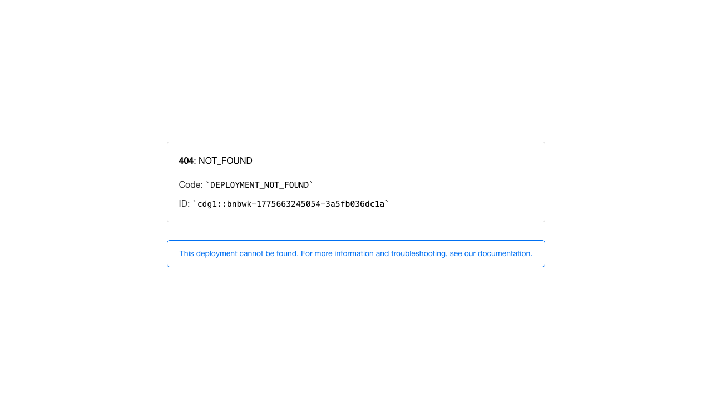

# gordacorp-immersive

Immersive front-end case study that turns a dry SAP audit narrative into a stylized long-scroll web experience.



## Objective

This repository exists as a public case study for immersive interface direction: how to make enterprise audit themes memorable without losing tension, clarity, or authorial voice.

## Case Study

### Problem

Most audit or compliance interfaces flatten serious subject matter into static dashboards. That is useful for operators, but weak as a narrative artifact or portfolio piece.

### Approach

This project reframes the subject as an atmospheric browser experience:

- single-file implementation for speed and portability
- cinematic HUD overlays, scanlines, and motion systems
- narrative acts that reveal jokes, code fragments, and audit tension progressively
- typography and color choices that make the piece feel authored instead of templated

### Result

The result is a compact interactive study in tone, pacing, and interface dramaturgy. It is intentionally closer to a digital scene than a conventional product demo.

## Stack

- Static HTML, CSS, and JavaScript
- Canvas effects and progressive reveal logic
- No build step

## Local Setup

```bash
python3 -m http.server 4173
```

Then open `http://127.0.0.1:4173`.

## Repository Notes

- [`index.html`](index.html) contains the entire experience.
- [`sonrisas_y_gordas.pdf`](sonrisas_y_gordas.pdf) is the source material that informed the piece.

## Status

Public visual case study kept visible as part of the curated GitHub surface.

See [`LICENSE`](LICENSE) for reuse limits.
